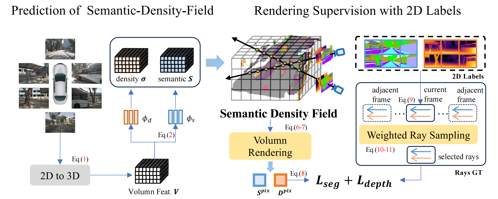

<details open>
<summary>FlashOcc on UniOcc and RenderOcc</summary>

<details open>
<summary>FlashOcc on UniOcc</summary>

### (As our models on Autodl is emptied by ourselves, we are now devote to reproduce them)
### Nuscenes Occupancy
| Config                                                                                                    | train times | mIOU  | FPS(Hz) | Flops(G) | Params(M) | Model                                                             | Log                                                                                          |
|-----------------------------------------------------------------------------------------------------------|-------|-------|-------|-------|-------|-------------------------------------------------------------------|----------------------------------------------------------------------------------------------|
| [**UniOcc-R50-256x704**](projects/configs/bevdet_occ/bevdet-occ-r50.py)                                       | - | - | - | - | - | - | - |
| [**M4:FO(UniOcc)-R50-256x704**](projects/configs/flashocc/flashocc-r50.py)         | - | - | - | - | - | - | - |
| [**UniOcc-R50-4D-Stereo-256x704**](configs/renderocc/renderocc-7frame-256x704.py)           | - | 38.46 | - | - | - | [baidu](https://pan.baidu.com/s/1n9W6DhVm1m0t0kK9ZGOM4Q?pwd=3h10) | [baidu](https://pan.baidu.com/s/1n9W6DhVm1m0t0kK9ZGOM4Q?pwd=3h10) |
| [**M5:FO(UniOcc)-R50-4D-Stereo-256x704**](configs/renderocc/renderocc-7frame-256x704-2d.py) | - | 38.76 | - | - | - | [baidu](https://pan.baidu.com/s/1n9W6DhVm1m0t0kK9ZGOM4Q?pwd=3h10) | [baidu](https://pan.baidu.com/s/1n9W6DhVm1m0t0kK9ZGOM4Q?pwd=3h10) |
| [**Additional:FO(UniOcc)-R50-4D-Stereo-256x704(wo-nerfhead)**](configs/renderocc/renderocc-7frame-wonerfhead-256x704-2d.py) | - | 38.44 | - | - | - | [baidu](https://pan.baidu.com/s/1n9W6DhVm1m0t0kK9ZGOM4Q?pwd=3h10) | [baidu](https://pan.baidu.com/s/1n9W6DhVm1m0t0kK9ZGOM4Q?pwd=3h10) |
| [**UniOcc-STBase-4D-Stereo-512x1408**](projects/configs/bevdet_occ/bevdet-occ-stbase-4d-stereo-512x1408.py) | - | - | - | - | - | - | - |
| [**M6:FO(UniOcc)-STBase-4D-Stereo-512x1408**](projects/configs/flashocc/flashocc-stbase-4d-stereo-512x1408.py) | - | - | - | - | - | - | - |

FPS are tested via TensorRT on 3090 with FP16 precision. Please refer to Tab.2 in paper for the detail model settings for M-number.

## Acknowledgement

Many thanks to these excellent open source projects:

- [BEVDet](https://github.com/HuangJunJie2017/BEVDet), [DVGO](https://github.com/sunset1995/DirectVoxGO), [Occ3D](https://github.com/Tsinghua-MARS-Lab/Occ3D), [SurroundDepth](https://github.com/JeffWang987/OpenOccupancy), [OpenOccupancy](https://github.com/JeffWang987/OpenOccupancy), [CVPR2023-Occ-Challenge](https://github.com/CVPR2023-3D-Occupancy-Prediction)

Related Projects:

- [FlashOcc](https://github.com/Yzichen/FlashOCC), [SurroundOcc](https://github.com/weiyithu/SurroundOcc), [TPVFormer](https://github.com/wzzheng/TPVFormer), [BEVFormer](https://github.com/fundamentalvision/BEVFormer), [VoxFormer](https://github.com/NVlabs/VoxFormer), [FB-Occ](https://github.com/NVlabs/FB-BEV), [SimpleOccupancy](https://github.com/GANWANSHUI/SimpleOccupancy), [OVO](https://github.com/dzcgaara/OVO-Open-Vocabulary-Occupancy)


</details>

<details open>
<summary>FlashOcc on RenderOcc</summary>
</details>

</details>

<details open>
<summary> Readme from ofiginal RenderOcc</summary>

# RenderOcc

### [paper](https://arxiv.org/abs/2309.09502) | [video](https://www.youtube.com/watch?v=UcdXM3FNLAc)


(Visualization of RenderOcc's prediction, which is supervised only with 2D labels.)

## INTRODUCTION

**RenderOcc** is a novel paradigm for training vision-centric 3D occupancy models **only with 2D labels**. Specifically, we extract a NeRF-style 3D volume representation from multi-view images, and employ volume rendering techniques to establish 2D renderings, thus enabling direct 3D supervision from 2D semantics and depth labels. 



## Getting Started

- [Installation](docs/install.md)

- [Prepare Dataset](docs/prepare_datasets.md)

- Train 
  
  ```
  # Train RenderOcc with 8 GPUs
  ./tools/dist_train.sh ./configs/renderocc/renderocc-7frame.py 8
  ```

- Evaluation 
  
  ```
  # Eval RenderOcc with 8 GPUs
  ./tools/dist_test.sh ./configs/renderocc/renderocc-7frame.py ./path/to/ckpts.pth 8
  ```

- Visualization
  
  ```
  # TODO
  ```

## Model Zoo

| Method    | Backbone  | 2D-to-3D  | Lr Schd | GT | mIoU  | Config | Log | Download  |
|:---------:|:---------:|:---------:|:-------:|:-------:|:-----:|:-----:|:-----------------------------------------------:|:-------------------------------------------------------------------------------------------:|
| RenderOcc | Swin-Base | BEVStereo | 12ep    | 2D | 24.46 | [config](configs/renderocc/renderocc-7frame.py) | [log](https://github.com/pmj110119/storage/releases/download/v1/20231006_000233.log) | [model](https://github.com/pmj110119/storage/releases/download/v1/renderocc-7frame-12e.pth) |

* More model weights will be released later.

## Acknowledgement

Many thanks to these excellent open source projects:

- [BEVDet](https://github.com/HuangJunJie2017/BEVDet), [DVGO](https://github.com/sunset1995/DirectVoxGO), [Occ3D](https://github.com/Tsinghua-MARS-Lab/Occ3D), [SurroundDepth](https://github.com/JeffWang987/OpenOccupancy), [OpenOccupancy](https://github.com/JeffWang987/OpenOccupancy), [CVPR2023-Occ-Challenge](https://github.com/CVPR2023-3D-Occupancy-Prediction)

Related Projects:

- [SurroundOcc](https://github.com/weiyithu/SurroundOcc), [TPVFormer](https://github.com/wzzheng/TPVFormer), [BEVFormer](https://github.com/fundamentalvision/BEVFormer), [VoxFormer](https://github.com/NVlabs/VoxFormer), [FB-Occ](https://github.com/NVlabs/FB-BEV), [SimpleOccupancy](https://github.com/GANWANSHUI/SimpleOccupancy), [OVO](https://github.com/dzcgaara/OVO-Open-Vocabulary-Occupancy)

## BibTeX

If this work is helpful for your research, please consider citing:

```
@article{pan2023renderocc,
  title={RenderOcc: Vision-Centric 3D Occupancy Prediction with 2D Rendering Supervision},
  author={Pan, Mingjie and Liu, Jiaming and Zhang, Renrui and Huang, Peixiang and Li, Xiaoqi and Liu, Li and Zhang, Shanghang},
  journal={arXiv preprint arXiv:2309.09502},
  year={2023}
}
```
</details>